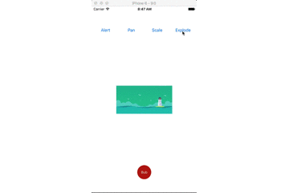
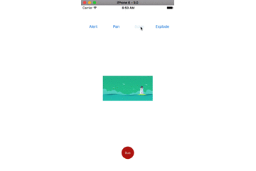
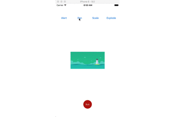
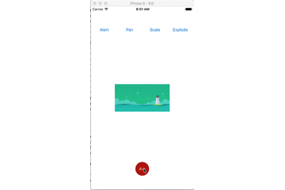
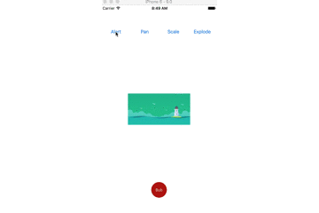

# XCPresentation

[](https://travis-ci.org/fanxiaocong/XCPresentation)
[](https://cocoapods.org/pods/XCPresentation)
[](https://cocoapods.org/pods/XCPresentation)
[](https://cocoapods.org/pods/XCPresentation)
[](https://www.apple.com/nl/ios/)&nbsp;

***
|Author|小小聪明屋|
|---|---|
|E-mail|1016697223@qq.com|
|GitHub|https://github.com/fanxiaocong|
|Blog|https://fanxiaocong.github.io|
***

## Example
自定义转场样式的封装，已经封装了几款常用的动画效果，并且支持自定义拓展，方便使用。

- `<XCPresentationAnimation.h>`&nbsp;自定义转场动画的基类，里面提供了一些共用的属性，您如果想要使用其他的转场动画，可以继承该类，然后重新实现内部的动画逻辑。
- `<XCPresentationExplodeAnimation.h>`&nbsp;自定义的一种屏幕截图切割平铺的转场动画。



```objc
XXXViewController *vc = [[UIStoryboard storyboardWithName:@"Main" bundle:NULL] instantiateViewControllerWithIdentifier:@"XXX"];
vc.presentStyle = PresentStyleBubble;
    
XCPresentationExplodeAnimation *animation = [[XCPresentationExplodeAnimation alloc] init];
    
[XCPresentation presentWithPresentationAnimation:animation presentedViewController:vc presentingViewController:self];
```
- `<XCPresentationScaleAnimation.h>`&nbsp;自定义的一种缩放的转场动画。



```objc
XXXViewController *vc = [[UIStoryboard storyboardWithName:@"Main" bundle:NULL] instantiateViewControllerWithIdentifier:@"XXX"];
vc.presentStyle = PresentStyleScale;
    
XCPresentationScaleAnimation *animation = [[XCPresentationScaleAnimation alloc] init];
animation.animationView = self.imgView;
animation.sourceFrame   = self.imgView.frame;
animation.destFrame     = CGRectMake(0, 0, self.view.bounds.size.width, 200);
    
[XCPresentation presentWithPresentationAnimation:animation presentedViewController:vc presentingViewController:self];
```
- `<XCPresentationPanAnimation.h>`&nbsp;自定义的一种平移的转场动画。



```objc
XXXViewController *vc = [[UIStoryboard storyboardWithName:@"Main" bundle:NULL] instantiateViewControllerWithIdentifier:@"XXX"];
vc.presentStyle = PresentStylePan;
    
XCPresentationPanAnimation *animation = [[XCPresentationPanAnimation alloc] init];
animation.presentStyle = XCPanAnimationPresentStyleFromCenter;
    
[XCPresentation presentWithPresentationAnimation:animation presentedViewController:vc presentingViewController:self];
```
- `<XCPresentationBubbleAnimation.h>`&nbsp;自定义的一种 Bubble 的转场动画。



```objc
XXXViewController *vc = [[UIStoryboard storyboardWithName:@"Main" bundle:NULL] instantiateViewControllerWithIdentifier:@"XXX"];
vc.presentStyle = PresentStyleBubble;
    
XCPresentationBubbleAnimation *animation = [[XCPresentationBubbleAnimation alloc] init];
animation.sourceRect  = btn.frame;
animation.strokeColor = btn.backgroundColor;
    
[XCPresentation presentWithPresentationAnimation:animation presentedViewController:vc presentingViewController:self];
```
- `<XCPresentationAlertAnimation.h>`&nbsp;自定义的一种 Alert 的转场动画。



```objc
XXXViewController *vc = [[UIStoryboard storyboardWithName:@"Main" bundle:NULL] instantiateViewControllerWithIdentifier:@"XXX"];
vc.presentStyle = PresentStyleAlert;
    
XCPresentationAlertAnimation *animation = [[XCPresentationAlertAnimation alloc] init];
animation.presentStyle = XCAlertAnimationPresentStyleFromTop;
animation.dismissStyle = XCAlertAnimationDismissStyleToRight;
    
[XCPresentation presentWithPresentationAnimation:animation presentedViewController:vc presentingViewController:self];
```


## Installation

### CocoaPods
```objc
pod 'XCPresentation'
```